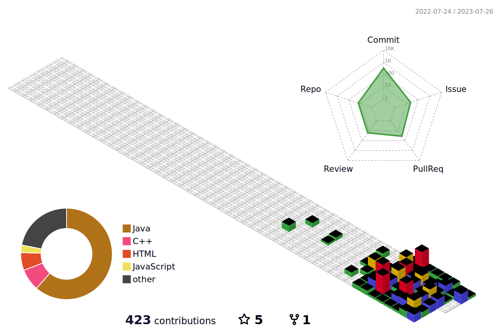

<!--
**uiseongsang/uiseongsang** is a ✨ _special_ ✨ repository because its `README.md` (this file) appears on your GitHub profile.

Here are some ideas to get you started:
👋
- 🔭 I’m currently working on ...
- 🌱 I’m currently learning ...
- 👯 I’m looking to collaborate on ...
- 🤔 I’m looking for help with ...
- 💬 Ask me about ...
- 📫 How to reach me: ...
- 😄 Pronouns: ...
- ⚡ Fun fact: ...
-->

  
  
  

👋 저의 깃허브에 들어와 주셔서 감사합니다!!

  몰입을 좋아하는 백엔드 개발자입니다!

- 🌱 저는 현재 스프링 부트캠프 교육을 받고 있습니다!
- 🤔 저는 문제해결을 중요시 생각하고 있습니다!
- 💬 질문이 있으시면 언제든지 주세요!
  

# <b>Stacks</b>
-------------
# Tool

  
  
  
  

# Language

  
  
  
  

----------------

